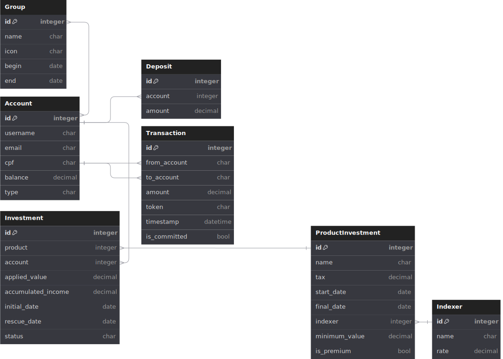

# Bank CAPS


## 📝 Sobre

Quem nunca ficou até depois da hora em alguma aula que atire a primeira pedra… Já não é de hoje que nossos queridos instrutores se empolgam e acabam prolongando as aulas por (muito) mais do que as 2 horas habituais. Após 10 turmas cheias de conteúdo e entusiasmo, o volume dessas &quot;moedas&quot; criadas durante as aulas tem crescido consideravelmente entre os alunos e ex-alunos. Por isso, percebemos a necessidade de um espaço dedicado não só para o armazenamento seguro dessas &quot;moedas&quot;, mas também para que elas possam gerar rendimentos ou serem transferidas mais facilmente entre vocês.


## 🎲 Diagrama de Entidade Relacionamento



## ⚙️ Pre-requisitos
- Python (3.12 ou superior)
- Docker
- Docker Compose


## 🏃‍♂️ Rodar
> Tenha certeza que criou o arquivo .env usando .env.example como template

Para rodar usando docker compose é apenas:

```
docker compose up --build
```
Para desligar:
```
docker compose down
```
Caso queira usar sem Docker, pode alterar a flag do arquivo ´.env´ para ´USING_REDIS=False´, dessa forma não é necessário o uso de docker, contudo a aplicação fica limitada, pois não consegue rodar funções do celery.

Para rodar sem docker é necessário primeiro criar um ambiente virtual python e ativá-lo:

```
python -m venv .venv

# Para Linux
source .venv/bin/activate

# Para Windows
.venv/Scripts/activate
```

Em seguida é necessário instalar as dependências:
```
pip install -r requirements.txt
```

Por fim, é só fazer as migrações e rodar o servidor:
```
python manage.py makemigrations
python manage.py migrate
python manage.py runserver
```